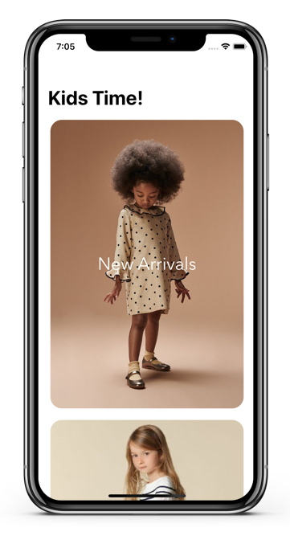

# KidsTime


[](https://developer.apple.com/iphone/index.action)
[](https://developer.apple.com/swift)


An application for your kids!
## Getting Started

``` bash
git clone https://github.com/rifqialfaizi/KidsTime.git
cd KidsTime
open LetsShop.workspace # or xed .

- Run (⌘ + R) or
- Test (⌘ + U)
```

## Kids Time! Design
  <p float="left">
    
     
     
  </p>

Feature: 
- Category Product 
- Collection Product in every Category
- Love button for product
- Chart
- Product Description


## Why I am building this?
1. Explore Table View 🔥
2. Learn new thing


## Preview

